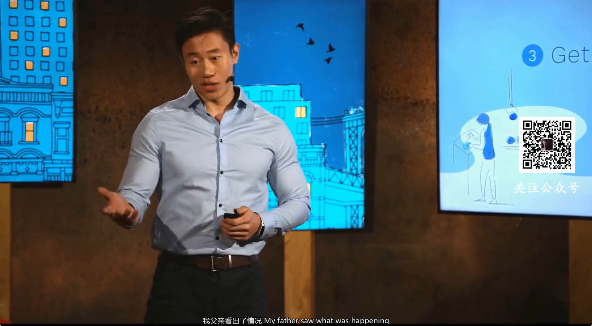

# 视频字幕生成系统

基于 Python + FastAPI + Ollama + Whisper 的智能视频字幕生成系统。支持语音识别、AI 字幕优化、多语言翻译、双语字幕与字幕烧录，全流程异步处理，配合 NVIDIA GPU 可获得接近实时的处理体验。


---

## 界面预览




---

## 功能特性

- **视频上传**：支持 MP4 / AVI / MKV / MOV / WMV / FLV / WebM 等常见格式，单文件最大 2GB
- **语音识别**：基于 OpenAI Whisper（medium 模型）自动识别语音，支持 NVIDIA GPU 加速（CUDA）
- **字幕优化**：通过 Ollama（Qwen3:14b）自动修正错别字、语法错误并智能断句
- **字幕翻译**：支持中英日韩等多语言互译，批量处理避免超时
- **双语字幕**：中文在上、英文在下的双语排列，支持导出与烧录
- **字幕烧录**：使用 moviepy 将字幕烧录进视频，优先 NVENC 硬件编码，自动回退 CPU
- **时间校准**：自动检测音频起始说话时间，修正字幕时间戳偏差
- **多格式导出**：支持 SRT / VTT / ASS / TXT 四种字幕格式
- **异步处理**：全异步任务管线，支持并发处理与实时进度反馈

---

## 项目架构

### 总体设计

系统采用「浏览器 + FastAPI 后端 + 服务层」的三层架构。前端负责上传与展示，后端负责任务编排与状态管理，服务层按职责拆分音视频处理、语音识别与 AI 增强三类独立模块。

```
┌──────────────────────────────────────────────────────────────┐
│                         浏览器（前端）                         │
│              HTML + CSS + JavaScript · 轮询任务进度            │
└──────────────────────────┬───────────────────────────────────┘
                           │ HTTP / JSON
┌──────────────────────────▼───────────────────────────────────┐
│                     FastAPI 后端（app.py）                     │
│  路由层：REST API · 静态资源 · 模板渲染                         │
│  任务层：内存任务注册表 · 异步任务编排 · 状态机                  │
│  配置层：Settings 集中管理全部可调参数                          │
└─────────┬───────────────┬──────────────┬─────────────────────┘
          │               │              │
┌─────────▼────────┐ ┌────▼───────┐ ┌────▼──────────────┐
│  services/       │ │ services/  │ │ services/         │
│  audio_extractor │ │ whisper_   │ │ ollama_service    │
│  音视频处理       │ │ service    │ │ AI 增强           │
└─────────┬────────┘ └────┬───────┘ └────┬──────────────┘
          │                │              │
     ┌────▼────┐     ┌─────▼─────┐  ┌─────▼─────┐
     │ FFmpeg  │     │  Whisper  │  │  Ollama   │
     │ moviepy │     │  medium   │  │ qwen3:14b │
     └─────────┘     └───────────┘  └───────────┘
```

### 模块说明

| 模块 | 职责 |
|------|------|
| `app.py` | FastAPI 主应用。负责路由注册、请求参数校验、任务生命周期管理与服务装配；集中定义 `Settings` 配置类与任务状态模型 |
| `services/audio_extractor.py` | 音视频处理层。基于 FFmpeg 提取音频（16kHz 单声道 WAV）、基于 moviepy 烧录字幕；自动探测 FFmpeg/FFprobe 路径，烧录时优先 NVENC 编码 |
| `services/whisper_service.py` | 语音识别层。封装 OpenAI Whisper：模型懒加载（`asyncio.Lock` 保证单例）、CUDA/CPU 自动选择、语音起始时间检测与时间戳校准 |
| `services/ollama_service.py` | AI 增强层。通过 `httpx.AsyncClient` 调用本地 Ollama API，提供字幕纠错优化与分批翻译（每批 20 条） |
| `utils/subtitle_formatter.py` | 字幕格式工具。统一将字幕片段导出为 SRT / VTT / ASS / TXT 四种格式 |

### 核心处理流程

上传视频后，后端为每个任务分配唯一 `task_id`，并通过 `asyncio.create_task` 编排异步处理管线：

```
上传视频
   │  校验格式 / 大小 → 生成 task_id → 进入任务队列
   ▼
① 音频提取    FFmpeg 提取音频 → 16kHz 单声道 WAV
   ▼
② 语音识别    Whisper(medium) 转录音频 → 字幕片段
   ▼
③ 时间校准    检测音频起始说话时间 → 校准所有字幕时间戳
   ▼
④ 生成 SRT    导出原始语言字幕文件
   ▼
⑤ 字幕优化    （可选）Ollama 修正错别字 / 语法 / 断句
   ▼
⑥ 字幕翻译    （可选）Ollama 分批翻译 → 生成双语字幕（中文在上，英文在下）
   ▼
⑦ 字幕烧录    （可选）moviepy 将字幕烧录进视频 → 输出带字幕视频
```

### 任务状态机

每个任务的生命周期遵循统一状态机，前端通过轮询 `/api/status/{task_id}` 获取实时进度：

```
pending ──→ processing ──→ completed
                │
                └──→ failed（错误信息记录到 error.log）
```

- 任务状态暂存于内存字典 `tasks`，适合单机部署；生产环境可替换为 Redis / 数据库
- 耗时操作（Whisper 推理、FFmpeg、moviepy 渲染）通过 `run_in_executor` 放入线程池，避免阻塞事件循环
- 后端保留 WebSocket 端点（`/ws/{task_id}`）用于实时推送，前端当前采用轮询模式

---

## 技术栈

| 层级 | 技术 | 说明 |
|------|------|------|
| 前端 | HTML + CSS + JavaScript | 原生实现，轮询模式获取进度 |
| 后端 | Python 3.10 + FastAPI + Uvicorn | 异步 Web 框架 |
| 语音识别 | OpenAI Whisper（medium） | 支持 CUDA 推理加速 |
| AI 增强 | Ollama + Qwen3:14b | 字幕纠错、断句、翻译 |
| 视频处理 | moviepy + FFmpeg | 音频提取、字幕烧录（NVENC） |
| GPU 加速 | PyTorch 2.5+cu121 + CUDA 12.1 | 模型推理与视频编码加速 |

---

## 目录结构

```
caption generation/
├── app.py                      # FastAPI 主应用：路由、任务编排、配置
├── requirements.txt            # Python 依赖清单
├── setup_env.bat               # 一键环境安装脚本（Windows）
├── start.bat                   # 一键启动脚本（Windows）
├── README.md                   # 项目说明
├── .gitignore                  # Git 忽略规则
├── docs/
│   └── images/                 # 文档图片资源
│       ├── show1.png           # 界面预览
│       └── show2.png           # 顶部区域
├── services/
│   ├── audio_extractor.py      # 音视频处理：FFmpeg 提音、moviepy 烧录
│   ├── whisper_service.py      # 语音识别：Whisper 封装、时间戳校准
│   └── ollama_service.py       # AI 增强：字幕优化、批量翻译
├── utils/
│   └── subtitle_formatter.py   # 字幕格式化：SRT / VTT / ASS / TXT
├── static/
│   ├── css/
│   │   └── style.css           # 前端样式
│   └── js/
│       └── main.js             # 前端逻辑：上传、轮询、下载、烧录
├── templates/
│   └── index.html              # 主页面模板
├── uploads/                    # 上传视频临时存储（gitignore）
├── outputs/                    # 字幕 / 烧录视频输出（gitignore）
└── models/
    └── whisper/                # Whisper 模型缓存（gitignore）
```

---

## 快速开始

### 1. 安装 Ollama

```bash
# 下载安装 Ollama
# https://ollama.ai/download

# 拉取 Qwen3:14b 模型
ollama pull qwen3:14b

# 启动 Ollama 服务
ollama serve
```

### 2. 创建 Conda 环境

```bash
# 方式一：运行环境安装脚本（Windows）
setup_env.bat

# 方式二：手动创建
conda create -n caption-gen python=3.10 -y
conda activate caption-gen

# 安装 PyTorch（CUDA 12.1）
pip install torch torchaudio --index-url https://download.pytorch.org/whl/cu121

# 安装其他依赖
pip install -r requirements.txt
```

### 3. 启动应用

```bash
# 方式一：运行启动脚本（Windows）
start.bat

# 方式二：手动启动
conda activate caption-gen
python -m uvicorn app:app --host 0.0.0.0 --port 8000 --reload
```

### 4. 访问应用

打开浏览器访问 `http://localhost:8000`，上传视频即可开始生成字幕。

---

## 使用流程

1. 上传视频：拖拽或点击上传，支持 MP4 / AVI / MKV / MOV 等格式
2. 语音识别：系统自动提取音频并调用 Whisper 识别
3. 字幕优化：Ollama 自动修正错别字和语法（可在翻译时勾选）
4. 字幕翻译：选择源语言与目标语言，支持多语言互译
5. 下载字幕：支持 SRT / VTT / ASS / TXT 格式
6. 烧录视频：将单语或双语字幕烧录进视频

---

## API 接口

启动应用后，交互式文档可访问 `http://localhost:8000/docs`。

| 方法 | 路径 | 说明 |
|------|------|------|
| GET | `/` | 主页面 |
| GET | `/api/info` | 系统信息（模型 / 格式 / GPU 状态） |
| POST | `/api/upload` | 上传视频，返回任务 ID |
| POST | `/api/process/{task_id}` | 触发异步处理管线 |
| GET | `/api/status/{task_id}` | 查询任务状态与进度 |
| POST | `/api/translate` | 字幕优化与翻译（可生成双语字幕） |
| GET | `/api/download/{task_id}` | 下载字幕（`?format=srt\|vtt\|ass\|txt&lang=`） |
| POST | `/api/burn-subtitles/{task_id}` | 烧录字幕到视频 |
| GET | `/api/tasks` | 任务列表 |
| DELETE | `/api/tasks/{task_id}` | 删除任务及关联文件 |

---

## 配置说明

所有配置集中在 `app.py` 的 `Settings` 类：

```python
class Settings:
    UPLOAD_DIR = BASE_DIR / "uploads"          # 上传目录
    OUTPUT_DIR = BASE_DIR / "outputs"          # 输出目录
    MAX_FILE_SIZE = 2 * 1024 * 1024 * 1024     # 最大文件 2GB
    ALLOWED_EXTENSIONS = {".mp4", ".avi", ".mkv", ".mov", ".wmv", ".flv", ".webm", ".m4v"}

    # Whisper 配置
    WHISPER_MODEL = "medium"                   # tiny/base/small/medium/large-v3
    WHISPER_DEVICE = None                      # cuda/cpu，None 自动选择
    WHISPER_LANGUAGE = None                    # 语言代码，None 自动检测

    # Ollama 配置
    OLLAMA_URL = "http://localhost:11434"
    OLLAMA_MODEL = "qwen3:14b"                 # 推荐 qwen3:14b
```

---

## 性能优化

- **GPU 加速**：Whisper 使用 CUDA 推理，字幕烧录优先 NVENC 硬件编码，失败自动回退 libx264
- **模型懒加载**：Whisper 模型按需加载并用 `asyncio.Lock` 保证单例，避免重复加载
- **线程池隔离**：所有耗时操作放入线程池执行，事件循环全程不阻塞
- **批量翻译**：字幕每 20 条一批调用 Ollama，减少请求次数并避免超时
- **音频校准**：自动检测音频起始说话时间，无需手动调整字幕偏移

---

## 常见问题

### GPU 不可用

检查 CUDA 是否正确安装：

```python
import torch
print(torch.cuda.is_available())
print(torch.cuda.get_device_name(0))
```

### Ollama 连接失败

确保 Ollama 服务正在运行：

```bash
ollama serve
ollama list   # 检查模型是否已下载
```

### 字幕烧录太慢

- 确保使用 GPU 编码（NVENC）
- 较长视频需要更多处理时间
- 可考虑使用更小的 Whisper 模型

### 字幕与音频不同步

程序会自动检测音频起始时间并校准。如仍有偏差，可在 `app.py` 中手动调整时间偏移量。

### 内存 / 显存不足

- 使用更小的 Whisper 模型：`tiny` 或 `base`
- 减小 Ollama 模型：`qwen3:8b`
- 或增加系统内存 / 显存

---

## 更新日志

### v1.1.0 (2026-06-15)

- 添加双语字幕支持（中文在上，英文在下）
- 添加字幕烧录功能，支持 GPU 编码
- 添加音频起始时间自动检测和校准
- 添加烧录计时显示
- 优化批量翻译性能
- 前端改用轮询模式获取任务状态

### v1.0.0 (2026-06-05)

- 初始版本发布
- 支持 Whisper 语音识别
- 支持 Ollama AI 翻译
- 支持多格式字幕导出

---

## 贡献

欢迎提交 Issue 和 Pull Request。

## 许可证

MIT License
